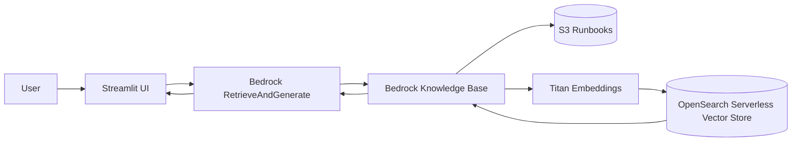

# 🛠️ Ops Copilot — AI DevOps Runbook Assistant (Amazon Bedrock)

Ops Copilot is a GenAI-powered DevOps assistant that answers production incident questions using operational runbooks stored in Amazon S3, grounded via Amazon Bedrock Knowledge Bases (RAG) and Titan Embeddings.

This project demonstrates how platform engineers can build an AI Copilot for on-call operations using fully managed AWS services.

---

## 🚀 Problem Statement

During incidents, engineers spend critical time:

* Searching runbooks
* Finding rollback steps
* Checking dashboards
* Remembering CLI commands

Ops Copilot enables natural language queries like:

> “ALB is returning 5xx after deploy — what should I check?”

And returns grounded answers with citations from real runbooks.

---

## 🧠 Architecture Overview

Flow:

1. Runbooks stored in S3 (Markdown)
2. Bedrock Knowledge Base parses + chunks documents
3. Titan Embeddings converts chunks to vectors
4. Stored in OpenSearch Serverless
5. RetrieveAndGenerate answers user questions
6. Streamlit UI displays grounded responses

---

## 📊 Architecture Diagram



---

## 📂 Repository Structure

```
ops-copilot-bedrock/
│
├── data/        # Sample runbooks
├── src/         # Bedrock scripts
├── infra/       # IAM + architecture docs
├── diagrams/    # Solution images
├── blog/        # Blog drafts
│
├── app.py       # Streamlit UI
├── requirements.txt
└── README.md
```

---

## 🛠️ AWS Services Used

* Amazon Bedrock
* Bedrock Knowledge Bases
* Titan Embeddings
* OpenSearch Serverless
* Amazon S3
* AWS IAM
* Streamlit (UI)

---

## ⚙️ Setup Instructions

### 1️⃣ Install dependencies

```bash
pip install -r requirements.txt
```

---

### 2️⃣ Configure environment variables

Create `.env` or export manually:

```bash
export AWS_REGION=us-east-1
export KB_ID=YOUR_KNOWLEDGE_BASE_ID
export MODEL_ID=amazon.nova-lite-v1:0
```

Windows PowerShell:

```powershell
setx AWS_REGION us-east-1
setx KB_ID your_kb_id
setx MODEL_ID amazon.nova-lite-v1:0
```

---

### 3️⃣ Run the Streamlit UI

```bash
streamlit run app.py
```

Open browser → http://localhost:8501

---

## 💬 Example Questions

* “ALB is returning 5xx — what should I check first?”
* “How do I rollback an ECS deployment?”
* “RDS CPU spike troubleshooting steps?”
* “Which CloudWatch metrics should I verify?”

---

## 🔐 IAM Permissions Required

Knowledge Base execution role must allow:

* `bedrock:InvokeModel`
* `bedrock:Retrieve`
* `bedrock:RetrieveAndGenerate`
* S3 read access
* OpenSearch access

Sample policy available in:

```
infra/iam-policy.json
```

---

## 💰 Cost Awareness

| Service               | Cost Behavior            |
| --------------------- | ------------------------ |
| S3                    | Very low cost            |
| Bedrock embeddings    | Pay per use              |
| Knowledge Base        | Active infra             |
| OpenSearch Serverless | Always-on (primary cost) |

### Portfolio Best Practice

Deploy → Demo → Capture screenshots → Delete infra → Recreate when needed

---

## 🧪 Sample Runbooks Included

Located in:

```
/data
```

Runbooks:

* ALB 5xx troubleshooting
* ECS rollback
* RDS CPU spike investigation

---

## 🧱 Future Enhancements

* Slack / Teams bot integration
* Incident auto-remediation
* CloudWatch alarm triggers
* Terraform deployment
* Multi-account runbook indexing

---

## 🧑‍💻 Author

**Sankar TK**
AWS DevOps Engineer

GitHub: https://github.com/Sankartk

---

## 📜 License

MIT License
