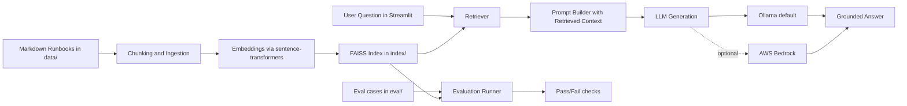
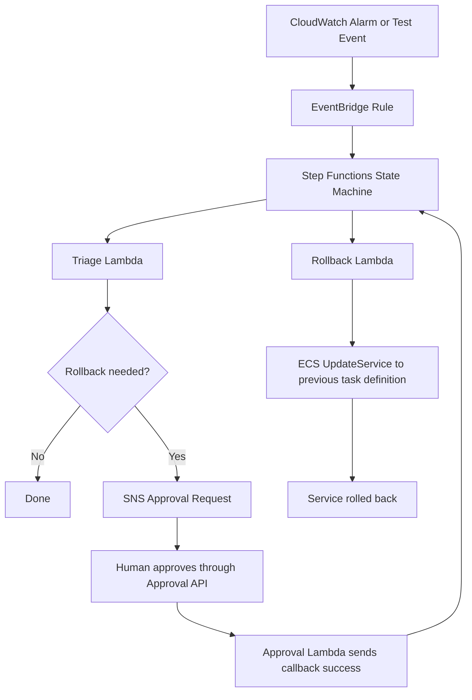
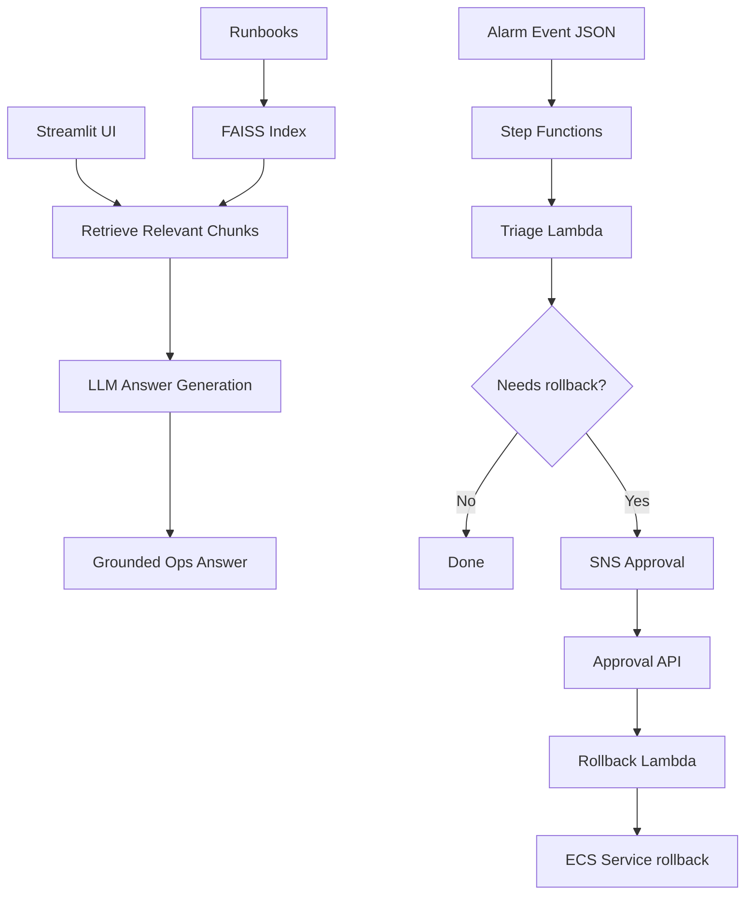

# Ops Copilot

Ops Copilot is an AI-assisted DevOps incident workflow that combines **local RAG over operational runbooks** with an **optional AWS approval-gated remediation pipeline**.

It has two major parts:

1. **Local runbook assistant**
   - indexes Markdown runbooks into a FAISS vector store
   - retrieves the most relevant chunks for an operational question
   - generates grounded answers using **Ollama** by default
   - supports **AWS Bedrock** as an optional generation backend

2. **AWS incident pipeline**
   - accepts CloudWatch-style alarm events
   - runs triage through AWS Step Functions and Lambda
   - requires human approval before risky remediation
   - can execute ECS rollback to a previous task definition

---

## Why this project matters

This project is not just a chatbot over docs.

It demonstrates how AI can be used in a **guardrailed operational workflow**:

- retrieve the right runbook context
- recommend the next action
- pause for human approval
- trigger controlled remediation
- keep rollback explicit and auditable

That makes it much closer to a realistic incident-response automation pattern than a simple Q&A demo.

---

## Core capabilities

### Local RAG assistant
- Ingests Markdown runbooks from `data/`
- Builds embeddings with `sentence-transformers`
- Stores vectors in **FAISS**
- Retrieves relevant chunks for a question
- Generates grounded answers with source references
- Includes a small evaluation harness for repeatable validation

### AWS workflow
- CloudWatch alarm style event ingestion
- Step Functions orchestration
- Triage Lambda for routing
- SNS approval gate
- Approval API callback
- Rollback Lambda for ECS service rollback
- Safe behavior when rollback context is missing

---

## Architecture

### 1) Local RAG flow


```mermaid
flowchart LR
    A[Markdown Runbooks in data/] --> B[Chunking and Ingestion]
    B --> C[Embeddings via sentence-transformers]
    C --> D[FAISS Index in index/]

    U[User Question in Streamlit] --> E[Retriever]
    D --> E
    E --> F[Prompt Builder with Retrieved Context]
    F --> G[LLM Generation]
    G --> H[Ollama default]
    G -. optional .-> I[AWS Bedrock]
    H --> J[Grounded Answer]
    I --> J

    K[Eval cases in eval/] --> L[Evaluation Runner]
    D --> L
    L --> M[Pass/Fail checks]
```

### 2) AWS incident pipeline


```mermaid
flowchart TD
    A[CloudWatch Alarm or Test Event] --> B[EventBridge Rule]
    B --> C[Step Functions State Machine]

    C --> D[Triage Lambda]
    D --> E{Rollback needed?}

    E -- No --> F[Done]
    E -- Yes --> G[SNS Approval Request]

    G --> H[Human approves through Approval API]
    H --> I[Approval Lambda sends callback success]

    I --> C
    C --> J[Rollback Lambda]
    J --> K[ECS UpdateService to previous task definition]
    K --> L[Service rolled back]
```

### 3) End-to-end demo flow


```mermaid
flowchart TD
    A[Runbooks] --> B[FAISS Index]
    C[Streamlit UI] --> D[Retrieve Relevant Chunks]
    B --> D
    D --> E[LLM Answer Generation]
    E --> F[Grounded Ops Answer]

    G[Alarm Event JSON] --> H[Step Functions]
    H --> I[Triage Lambda]
    I --> J{Needs rollback?}
    J -- No --> K[Done]
    J -- Yes --> L[SNS Approval]
    L --> M[Approval API]
    M --> N[Rollback Lambda]
    N --> O[ECS Service rollback]
```

---

## Repository structure

```text
.
├─ app.py
├─ run_all.bat
├─ requirements.txt
├─ README.md
├─ data/                       # Markdown runbooks
├─ index/                      # Generated local artifacts
├─ src/
│  ├─ __init__.py
│  ├─ config.py
│  ├─ embed_local.py
│  ├─ query.py
│  ├─ llm_generate.py
│  ├─ local_llm.py
│  ├─ build_index.py
│  └─ ingest.py
├─ eval/
│  ├─ __init__.py
│  ├─ cases.json
│  └─ run_eval.py
└─ infra/
   ├─ template.yaml
   ├─ samconfig.toml
   └─ aws_lambda/
      ├─ triage/
      ├─ approval/
      └─ rollback/
```

---

## Tech stack

- Python
- Streamlit
- FAISS
- sentence-transformers
- Ollama
- AWS Lambda
- AWS Step Functions
- AWS SNS
- Amazon ECS
- AWS SAM

---

## Local quickstart

### Prerequisites
- Python 3.10+
- Ollama installed and running

### Create virtual environment

```bash
python -m venv .venv
```

Windows:

```bash
.venv\Scripts\activate
```

macOS/Linux:

```bash
source .venv/bin/activate
```

### Install dependencies

```bash
pip install -r requirements.txt
```

### Configure environment

```bash
copy .env.example .env
```

or on macOS/Linux:

```bash
cp .env.example .env
```

Default local mode:

```env
LLM_PROVIDER=ollama
OLLAMA_HOST=http://localhost:11434
OLLAMA_MODEL=llama3.2:3b
```

### Add runbooks

Put Markdown runbooks into:

```text
data/
```

### Build the FAISS index

```bash
python -m src.build_index --data-dir data --index-dir index
```

### Run evaluation

```bash
python -m eval.run_eval
```

### Start the Streamlit app

```bash
streamlit run app.py
```

---

## One-command local runner

For Windows CMD:

```bash
run_all.bat
```

This script can:
- create and activate a virtual environment
- install dependencies
- build the local index
- run evaluation
- check Ollama
- optionally build and deploy the AWS SAM stack
- start Streamlit

To enable SAM deployment inside the batch run:

```bash
set DEPLOY_SAM=1
run_all.bat
```

---

## AWS deployment

From `infra/`:

```bash
sam validate --template-file template.yaml
sam build --template-file template.yaml
sam deploy --guided --template-file .aws-sam/build/template.yaml
```

After deploy, note these stack outputs:
- `StateMachineArn`
- `ApprovalApiUrl`

---

## Demo flow

### Start a test execution

```bash
aws stepfunctions start-execution \
  --region us-east-1 \
  --state-machine-arn <StateMachineArn> \
  --name demo-123 \
  --input file://test_alarm_ecs.json
```

### Approve a rollback

```bash
curl -G "<ApprovalApiUrl>" \
  --data-urlencode "decision=APPROVE" \
  --data-urlencode "token=<TOKEN>"
```

### ECS rollback input
For a real rollback demo, the input must include:

```json
{
  "cluster": "ops-copilot-demo-cluster",
  "service": "ops-copilot-demo-service",
  "previous_task_definition": "ops-copilot-demo:1"
}
```

---

## Evaluation

The evaluation harness validates grounded answers for sample operational scenarios such as:
- ALB 5xx spike triage
- RDS CPU spike triage

Run:

```bash
python -m eval.run_eval
```

Results are written to:

```text
eval/eval_results.json
```

---

## Guardrails and safety

This project intentionally includes operational guardrails:

- grounded answers from retrieved runbook context
- explicit approval before rollback
- rollback skipped unless required ECS context is provided
- rollback Lambda limited to ECS update actions
- human-in-the-loop control for risky remediation

---

## What this project demonstrates

This project demonstrates practical experience with:

- Retrieval-Augmented Generation
- vector search with FAISS
- prompt grounding and answer constraints
- local LLM integration with Ollama
- optional cloud inference with Bedrock
- AWS Lambda
- AWS Step Functions
- SNS approval workflows
- ECS rollback orchestration
- infrastructure deployment with AWS SAM

---

## Limitations

- Retrieval quality depends on runbook quality and chunking strategy
- Routing logic is heuristic-based, not a learned classifier
- Approval flow is email plus token callback, not Slack or SSO integrated
- Demo rollback uses explicit ECS context rather than automated discovery
- This is a portfolio/demo project, not a production incident platform

---

## Future improvements

- Better reranking and retrieval quality
- Slack / Teams approval integration
- Richer observability dashboards
- Automatic rollback context discovery
- Support for more remediation actions beyond ECS rollback
- Safer IAM scoping for ECS and pass-role permissions
- UI for execution history and approval actions

---

## Cost note

Local mode is effectively free beyond local machine resources.

The AWS demo uses paid AWS services such as:
- Lambda
- Step Functions
- SNS
- API Gateway
- EventBridge
- ECS Fargate for rollback demo

For short-lived demos, cost is usually very low, but not zero. Delete ECS and stack resources after testing.

---

## License

Add a license of your choice, such as MIT.
